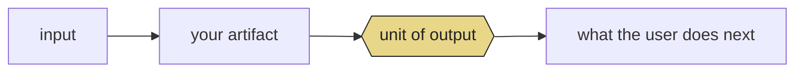

<!--
  PAPER-TEMPLATE.md — starter template for your Level 2 paper.

  HOW TO USE:
  1. Copy this file into your own GitHub repo as PAPER.md (all caps is traditional for working papers).
  2. Read GUIDE-FROM-SPACE-TO-PAPER.md before filling it in.
  3. Delete every <!-- instructor note --> line once you've answered it.
  4. Worked example to keep open in another tab while you write:
     https://github.com/buildLittleWorlds/bluest-hour-almanac/blob/main/PAPER.md

  Everything below uses only markdown features GitHub renders: tables, blockquotes,
  footnotes, <details>, <sub>, <kbd>, <picture>, alert blocks (> [!NOTE]),
  LaTeX ($ and $$), Mermaid diagrams, emoji, horizontal rules.
  Don't use raw CSS or JS — GitHub strips them.
-->

<div align="center">

###### <sub>YOUR PROJECT NAME · WORKING PAPERS</sub> · <sub>VOL. I · NO. 001</sub> · <sub>MMXXVI</sub>

# Your Title Here

### *A commentary on* your artifact name,
### *and on the small form that holds it*

<sub>YOUR CITY · JD — OR OMIT IF NOT A DATED PHENOMENON</sub>

---

<!--
  instructor note: the epigraph is a one-sentence quote from a writer, scientist,
  philosopher, critic, or practitioner in your domain. It sets the paper's tone and
  signals to the reader that your work is in conversation with something larger.
  Example domains: medicine → a memoir, a doctor-writer, a history of medicine;
  music → a critic, a composer, a memoir; politics → a journalist, an essayist;
  image generation → an art historian, a critic; game dev → a designer, a theorist.
  Pick a quote you actually like. A bad epigraph is worse than none.
-->

> *"Your epigraph here — one or two sentences, no more."*
>
> — Author Name, *Work Title*

---

</div>

&nbsp;

## Abstract

<!--
  instructor note: ~5 sentences. State what you built, the unusual choice you
  made (the "costume"), the angle you're reading it from (4 levels, 3 levels,
  whatever — don't fake it; pick what honestly applies), and the small category
  or claim you end up proposing. Write this LAST, after §§ I–XI are drafted.
-->

`[Artifact name]` is ______. This paper argues that ______. We read the artifact at ______ levels — ______ — and end with a short argument for what we call ______.

**Keywords** &nbsp;·&nbsp; keyword · keyword · keyword · keyword · keyword

&nbsp;

---

## <sub>§ I.</sub> &nbsp; The artifact

<!--
  instructor note: the inventory table. This is the only section that is
  purely factual. Copy URLs, model IDs, line counts, dependencies. If a
  reviewer wanted to rebuild your thing from scratch, this table plus your
  repo should be enough.
-->

| | |
|---|---|
| **Title** | Your project's full title |
| **Medium** | Single `app.py` + Gradio? · Static HTML? · Notebook? |
| **Typeface / Palette** | Optional — only if this is a design-forward project |
| **Dependencies** | Models (with HF links), APIs, core libraries |
| **Deployments** | [GitHub](…) · [Hugging Face Space](…) |
| **Lines of code** | ≈ ___ |
| **Reading time** | A short, honest estimate — "a coffee," "ten minutes," etc. |

<!--
  instructor note: 2–3 sentences describing the artifact's shape. What does
  the user see when they open it? What does it do? Don't sell — describe.
-->

The artifact opens with ___. It closes with ___. In between it does ___ things: ___.

&nbsp;

---

## <sub>§ II.</sub> &nbsp; Why this form

<!--
  instructor note: every artifact has a GENRE. A sentiment app is either a
  "toy," an "educational demo," a "personal instrument," or a "research
  probe." They look the same from the outside but claim different things.
  Your §II names your genre explicitly and compares it to the one it is NOT.

  Table of contrasts — keep it 2–4 rows. Example axes to pick from:
    - claims to be (authority? curiosity? precision? play?)
    - reader posture (glance? sit down? hover? walk away?)
    - time-sense (an hour? a year? one question? a lifetime?)
    - the unit it returns (a number? a label? a story? a picture? a choice?)
-->

The default genre of a [your task] tool is a ______. I have made ______ instead. The two forms claim different things:

| form | claims to be | reader posture | what it returns |
|---|---|---|---|
| [default] | ______ | ______ | ______ |
| [yours] | ______ | ______ | ______ |

<!-- instructor note: 2–3 sentences of *why this matters* for your domain. -->

[One paragraph.]

> [!NOTE]
> A small aside that would be a digression in the main text but that a reader will appreciate.

&nbsp;

---

## <sub>§ III.</sub> &nbsp; The anatomy of [your phenomenon]

<!--
  instructor note: this is the technical section. If your project involves math,
  put it here (LaTeX with $ or $$). If it involves a chart, an ASCII figure in a
  ``` code fence ``` renders cleanly on GitHub. If it involves a model pipeline,
  a Mermaid diagram works. Pick whichever ONE fits.

  The key move: explain the phenomenon your artifact exists to observe, not the
  artifact itself. The artifact is an instrument; this section explains what
  the instrument measures.
-->

[One paragraph introducing the phenomenon.]

$$
\text{optional formula} = \text{if you have one}
$$

```
 ┌──────────────────────────────────────────────────────────────┐
 │ Fig. 1 · Optional ASCII figure                               │
 ├──────────────────────────────────────────────────────────────┤
 │                                                              │
 │  Draw something. A curve, a distribution, a timeline, a      │
 │  side-by-side comparison. Keep it to ~12 lines. If your      │
 │  artifact already renders a chart, this is its ASCII twin.   │
 │                                                              │
 └──────────────────────────────────────────────────────────────┘
```

<!-- instructor note: close by stating the one fact this section gives the reader that no one else will tell them. -->

It is worth dwelling on the fact that ______.

&nbsp;

---

## <sub>§ IV.</sub> &nbsp; Your "Δ" — the tunable that is *you*

<!--
  instructor note: Bluest Hour's Δ = 35 minutes is "the author's estimate,"
  not an astronomical constant. Every honest artifact has one: the number,
  the threshold, the prompt wording, the curated list, the chosen baseline —
  that encodes your personal judgment. Name it. Defend it. This is the only
  place in the paper where you are personally present.
-->

<kbd>Δ = your parameter</kbd> is the current setting. It is not a ___; it is ___.

[One paragraph on why you picked that value and what the "right" value would be if you could measure it.]

> [!TIP]
> An aside about how this value could, in principle, be learned or tuned — but isn't, because ___.

&nbsp;

---

## <sub>§ V.</sub> &nbsp; The unit

<!--
  instructor note: every artifact has a UNIT of output — a number, a label,
  a paragraph, an image, a 20-minute walk. What is yours, and why that
  *size*? This section explains the choice of size/length/grain.
-->

The ______ is the artifact's unit, the way a tablespoon is a recipe's unit of volume. It is:

- **Long/big enough** to ___.
- **Short/small enough** to ___.
- **Chosen so that** ___.



&nbsp;

---

## <sub>§ VI.</sub> &nbsp; The model, and why that one

<!--
  instructor note: name your model. Link to its HF page. Explain why this one
  and not a larger/smaller/different one. If your project doesn't use an ML
  model, replace this section with "The data, and why that dataset" or "The
  source, and why that source" — same shape either way.

  The move to make: don't describe what the model does. Describe what it
  *quantizes* — what continuous phenomenon it collapses into a vocabulary.
-->

§ [wherever] of the artifact uses [`model-id`](https://huggingface.co/...) to ______.

This is an odd / obvious / interesting pairing because ______. Both the artifact and the classifier are doing the same thing: **taking a continuous phenomenon and quantizing it into a vocabulary.**

<table>
<tr><th align="left">the artifact quantizes…</th><th align="left">…into</th></tr>
<tr><td>continuous phenomenon</td><td>its taxonomy</td></tr>
<tr><th align="left">the model quantizes…</th><th align="left">…into</th></tr>
<tr><td>user's ___</td><td>N labels / classes / buckets</td></tr>
</table>

> [!IMPORTANT]
> One sentence on privacy / locality / where the inference runs. Does the user's data leave the browser? Why does that matter?

&nbsp;

---

## <sub>§ VII.</sub> &nbsp; Interface as argument

<!--
  instructor note: optional but encouraged. The interface of an artifact is
  making a claim. Typography, color, what the buttons say, what the empty
  state shows — all of it is rhetoric. Pick one interface choice and read it.

  If your artifact is a plain Gradio app with default chrome, skip this
  section or replace it with "Prompt as argument" (how you worded the prompt
  does the same work that typography does in a designed artifact).
-->

[One paragraph on one interface choice in your artifact and what it claims.]

> One sentence — the "thesis line" of this section.

&nbsp;

---

## <sub>§ VIII.</sub> &nbsp; A reading of [the masthead / the default prompt / the first thing the user sees]

<!--
  instructor note: quote your artifact back to itself. Paste the title bar,
  the default prompt, the welcome message, the opening screen, the first
  emoji — whatever the user's first two seconds contain. Then read it.
-->

```
  [paste the literal text / ASCII of your first-screen here]
```

[One paragraph reading it. What does this opening smuggle in as if it were a fact?]

&nbsp;

---

## <sub>§ IX.</sub> &nbsp; Toward [your small category]

<!--
  instructor note: this is the move that makes it a PAPER and not a writeup.
  Propose a small category, a small definition, a small claim — something
  that, if a reader agreed with you, would change how they see tools like
  yours. Don't be grand. Be specific.

  Bluest Hour proposes "ephemeral interfaces: software whose primary
  function is to tell you when to stop using it." That's a specific,
  defendable, small claim. Yours should be similarly small and specific.
-->

I'd like to propose a small category.

> **Your category here** &nbsp;*n.* &nbsp; A piece of software whose primary function is to ______. Its success is measured in ______.

The [artifact] is an instance. Its figure of merit is ______. Every design choice in the artifact is legible once you take this framing seriously:

1. **No ___** — because ___.
2. **Has ___** — because ___.
3. **Returns ___** — because ___.

&nbsp;

---

## <sub>§ X.</sub> &nbsp; What's missing

<!--
  instructor note: a task list of what the artifact doesn't do yet. This is
  honest AND makes your artifact look like a research probe (open ended)
  rather than a finished product (closed off). 3–5 items, each 1–2 sentences.
-->

In the spirit of field notes:

- [ ] **Item.** Sentence on what's missing and what it would take.
- [ ] **Item.** Sentence on what's missing and what it would take.
- [ ] **Item.** Sentence on what's missing and what it would take.
- [x] **Thing already done.** Cross out one item you already did, to show you've been paying attention.

&nbsp;

---

## <sub>§ XI.</sub> &nbsp; Closing

<!--
  instructor note: 2 short paragraphs. First paragraph: restate what the
  artifact is at its smallest and most honest. Second paragraph: the last
  line should feel like a door closing. Read the Bluest Hour closing for
  tone — it's a single concrete sentence that lands.
-->

[One paragraph.]

[One paragraph ending in a single concrete sentence.]

<div align="center">

*Fin.*

</div>

&nbsp;

---

## Colophon

<!--
  instructor note: three columns, facts only. Typography, method, data sources,
  inference models, deployment, acknowledgments, date, location. Keep it tight.
-->

<table>
<tr>
<td>

**Method**
&nbsp;
How you actually made it

**Tools**
&nbsp;
Libraries, editors, services

**Composed in**
&nbsp;
Plain Markdown

</td>
<td>

**Data**
&nbsp;
Where your data came from

**Inference**
&nbsp;
Model(s) and runtime

**Epigraph**
&nbsp;
Source of the quote above

</td>
<td align="right">

<sup>MMXXVI</sup>
&nbsp;
Your city
&nbsp;
*Student work, Level 2*
&nbsp;
`git log --follow PAPER.md`

</td>
</tr>
</table>

&nbsp;

---

## Notes

<!--
  instructor note: 3–5 footnotes. One for each prior work you cite in Consensus
  searches. One for any unusual tool or model you use. Footnotes are the paper's
  nerve endings — they show you've read around your problem.
-->

[^one]: Author, *Title* (Year). One sentence on why this matters to your argument.

[^two]: Author, *Title* (Year). One sentence.

[^three]: Author, *Title* (Year). One sentence.
