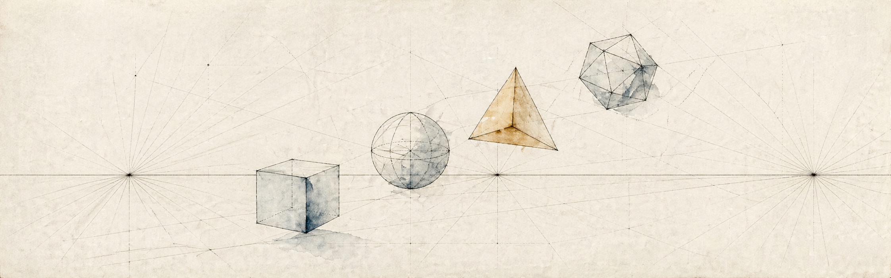
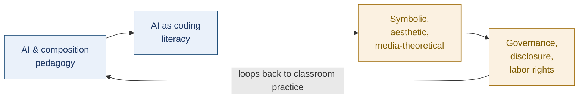

<!--
Variant B — Mid-Distinctive (recommended starting point) — REVISED April 2026

Revisions made against the full scholarship dossier:
- Position statement broadened beyond disclosure to the four actual research clusters
- Books section promoted to be visible above publications (three Hutson co-authored books plus co-edited Routledge volume)
- "In Progress" section added for Perspectiva Artificialis (Routledge 2026) and Semantic Density (manuscript)
- Reception block added: Postdigital Science and Education review of The Case Against Disclosure; Critical Conversations podcast
- Mermaid diagram rebuilt around the four real clusters from the dossier
- MFA Arkansas added to the credential line
- "Frequent collaborators" line added (Hutson primary; Melick, Edele recurring)
- Now line updated to reference Perspectiva Artificialis work
- Banner image (.assets/banner-light.svg / banner-dark.svg) still placeholder — see implementation notes in the audit doc

Design notes (delete this comment block before committing):
- One banner image at top, light/dark variants via <picture>. Banner SVGs live in this profile repo.
- Now line at the top gives the page a heartbeat without scheduled-Action infrastructure. Update manually when the answer changes.
- Renders well on mobile because there are no fixed-pixel-width side-by-side elements; everything stacks naturally.
-->

  

  
  
  

B.A. Taylor &nbsp;·&nbsp; M.F.A. Arkansas &nbsp;·&nbsp; Ph.D. Washington University in St. Louis

---

I'm a Professor of English at Lindenwood University. I write about generative AI as a problem of authorship, symbolic form, pedagogy, and institutional governance — not as an external threat to the humanities, and not as a frictionless solution to anything either. My current writing develops alternatives to mandatory process disclosure, an aesthetic theory of generative output as symbolic object, AI-mediated coding as humanities literacy, and worker-side accountability frameworks for AI-mediated labor.

The position underneath all of it is the same: **authorship is responsibility, judgment, and accountability for what is presented — not exhaustive reporting of every tool, prompt, revision, or technological intervention.**

> **Now** *(updated April 2026)* — Drafting *The New Perspectiva Artificialis* (Routledge, 2026); running the Spring 2026 cohort of *AI + Research Level 2*; expanding *10 Things to Try with Hugging Face Transformers* with new sections on Spaces and API contracts.

## How the Work Fits Together

The four clusters answer one underlying question — *what does responsible authorship look like when AI is a normal part of the workflow?* — at four different scales: the individual writer, the classroom and the curriculum, the symbolic object the model produces, and the institution that has to set policy.

## Books

<!-- BOOKS-START -->

- 📕 **[The Case Against Disclosure: Defending Creative Autonomy in the Age of AI](https://digitalcommons.lindenwood.edu/faculty-research-papers/756/)** — with James Hutson. Common Ground Research Networks, 2025. Argues against mandatory process-disclosure for AI use; develops an alternative grounded in responsibility for outcomes. *Reviewed in [Postdigital Science and Education](https://link.springer.com/article/10.1007/s42438-026-00629-5).*
- 📘 **[Beyond Code: Redefining Programming Education Beyond STEM](https://digitalcommons.lindenwood.edu/faculty-research-papers/752/)** — with James Hutson. Chapman & Hall / Routledge, 2025. Reframes software literacy for humanities and interdisciplinary practice in the age of AI-assisted coding.
- 📗 **[Mind, Machine, and Will: Determinism, Responsibility, and Agency in the Age of AI](https://digitalcommons.lindenwood.edu/faculty-research-papers/763/)** — with James Hutson. Nova Science Publishers, 2025. Synthesis on agency, moral responsibility, governance, and human-machine collaboration.
- 📒 **[Generative AI in the English Composition Classroom: Practical and Adaptable Strategies](https://www.taylorfrancis.com/books/edit/10.4324/9781003507949/generative-ai-english-composition-classroom-james-hutson-daniel-plate-elizabeth-melick-susan-edele)** — co-edited with James Hutson, Elizabeth Melick, Susan Edele. Routledge Research in Writing Studies, 2024/25.

<!-- BOOKS-END -->

### In Progress

- **The New Perspectiva Artificialis: From the Mechanical Eye to the Algorithmic Symbolic Form** — Routledge, accepted for 2026. Argues Renaissance linear perspective and transformer architectures are structurally parallel revolutions in symbolic mediation. Combines symbolic-form theory with mechanistic interpretability and reproducible notebooks.
- **Semantic Density** — manuscript complete. Applies Goodman's symbolic-form aesthetics to chain-of-density prompting, generative world-making, and algorithmic criticism.

## Selected Articles

<!-- ARTICLES-START -->

- **[The Case for Selective Non-Transparency in AI-Mediated Work: A Workers' Rights Framework](https://digitalcommons.lindenwood.edu/faculty-research-papers/787/)** — extends the disclosure argument into labor and professional practice. *Employee Responsibilities and Rights Journal*, 2025.
- **[The Intellectual Bankruptcy of Anti-AI Academic Alarmism: A Rebuttal](https://digitalcommons.lindenwood.edu/faculty-research-papers/774/)** — *Teaching in Higher Education*, 2025. Discussed on the [*Critical Conversations*](https://www.tandfonline.com/journals/cthe20) podcast.
- **[Writing as Curation: Empowering Authorial Agency in AI-Assisted Composition](https://digitalcommons.lindenwood.edu/ijedie/vol3/iss1/3/)** — relocates authorial agency from originary self-expression to curatorial control over discourse resources. *International Journal of Emerging and Disruptive Innovation in Education*, 2025.
- **[Bridging Classical Rhetoric and AI: A Systematic Framework for Developing Authorial Voice Through Large Language Models](https://digitalcommons.lindenwood.edu/theses/1411/)** — M.A. thesis, Lindenwood, 2025.
- **[Large Language Models as Machines of Beauty: Cognitive Averaging, Latent Space Geometry, and the Entropic Foundations of Aesthetic Preference](https://digitalcommons.lindenwood.edu/faculty-research-papers/)** — *ISAR Journal*, 2025.
- **[The Pastor as Romantic Author: AI, Preaching, and the Unacknowledged Inheritance of Authenticity](https://doi.org/10.30560/mct.v1n2p14)** — *Media, Communication, and Technology*, 2025.
- **[Reclaiming the Symbol: Ethics, Rhetoric, and the Humanistic Integration of GAI — A Burkean Perspective](https://zenodo.org/records/10802930)** — *ISRG Journal*, 2024.
- **[Embracing AI in English Composition: Insights and Innovations in Hybrid Pedagogical Practices](https://ojs.bonviewpress.com/index.php/IJCE/article/view/2290)** — *International Journal of Changes in Education*, 2024.
- **[The Algorithm of Fear: Unpacking Prejudice Against AI and the Mistrust of Technology](https://doi.org/10.61453/joit.v2024no38)** — *Journal of Innovation and Technology*, 2024.
- **[Working With (Not Against) the Technology: GPT-3 and Artificial Intelligence in College Composition](https://digitalcommons.lindenwood.edu/faculty-research-papers/490/)** — *Journal of Robotics and Automation Research*, 2023.
- **[Augmented Creativity: Leveraging Natural Language Processing for Creative Writing](https://doi.org/10.4236/adr.2022.103029)** — *Art and Design Review*, 2022.

Plus chapters in *Generative AI in the English Composition Classroom* and other edited volumes; further articles via [Lindenwood DigitalCommons](https://digitalcommons.lindenwood.edu/do/search/?q=Plate&fq=author_display:%22Daniel%20Plate%22).

<!-- ARTICLES-END -->

## Public Courses and Tools

I make small-to-medium experiments that try to make AI systems legible to students, writers, and non-specialist builders. The two anchor projects below are the most-used; the rest sit between them as variants and companions.

### 🛠 10 Things to Try with Hugging Face Transformers

A ten-notebook course that walks complete beginners from a single line of `pipeline()` code up through pipeline internals, embedding spaces, and model comparison. The design constraint: every notebook has to run end-to-end on a free Colab session, and every notebook has to leave the student with a working artifact, not just a tutorial they followed once. → [github.com/buildLittleWorlds/10-things-to-try-with-hugging-face](https://github.com/buildLittleWorlds/10-things-to-try-with-hugging-face)

### 🛠 Human-Centered AI Applications

A semester course where non-CS undergraduates move from a problem they care about — usually drawn from their major or their personal life — to a deployed Hugging Face Space. The pedagogical engine is the **Plan-Direct-Examine-Record** workflow: students plan an experiment, direct the model, examine what comes back, and record what they learned, before iterating. The course is written so a humanities major can use it without ever taking a CS class. → [github.com/buildLittleWorlds/human-centered-ai-applications](https://github.com/buildLittleWorlds/human-centered-ai-applications)

### Also available

- [10 Things to Try with Vision Transformers](https://github.com/buildLittleWorlds/10-things-to-try-vision-transformers) — companion to the Hugging Face course, focused on image models.
- [AI Model Experiments](https://github.com/buildLittleWorlds/ai-model-experiments) — Hugging Face and Colab curriculum for running models and reading model cards critically.
- [Claude Code Skills: Basics and Beyond](https://github.com/buildLittleWorlds/claude-code-skills-basics-and-beyond) — course sequence on Claude Code, skills, hooks, subagents, and multi-step AI-assisted development.
- [Transformers.js Experiments](https://github.com/buildLittleWorlds/transformers-js-experiments) — browser-based experiments with WebGPU, ONNX Runtime, and lightweight AI interfaces.
- [Bluest Hour Almanac](https://github.com/buildLittleWorlds/bluest-hour-almanac) — design and AI classification experiment built around a blue-hour walk journal.

## Reception

- **[Postdigital Science and Education](https://link.springer.com/article/10.1007/s42438-026-00629-5)** — review essay of *The Case Against Disclosure*, Springer, 2026.
- **[*Critical Conversations* podcast](https://www.tandfonline.com/journals/cthe20)** — interview on *The Intellectual Bankruptcy of Anti-AI Academic Alarmism*, hosted by Ibrar Bhatt for *Teaching in Higher Education*.
- A formal review of *Generative AI in the English Composition Classroom* in *International Journal of Computer-Assisted Language Learning and Teaching* (2025); a further review forthcoming in *TESOL Quarterly* (2026).

## Frequent Collaborators

Most of the collaborative work above is co-authored with **[James Hutson](https://www.lindenwood.edu/academics/colleges-and-schools/college-of-arts-and-humanities/faculty-and-staff/james-hutson/)** (Lindenwood). Recurring co-authors on the composition volume and related pieces include **Elizabeth Melick** and **Susan Edele**. Single-authored work is marked accordingly.

## Where to Reach Me

[Lindenwood faculty profile](https://www.lindenwood.edu/arts-and-humanities/english-language-interdisciplinary-studies/english-ba/faculty/dan-plate/) · [ORCID](https://orcid.org/0000-0002-1238-5425) · [GitHub](https://github.com/buildLittleWorlds)

---

*"Responsibility for the final work, not exhaustive reporting of the process."*
