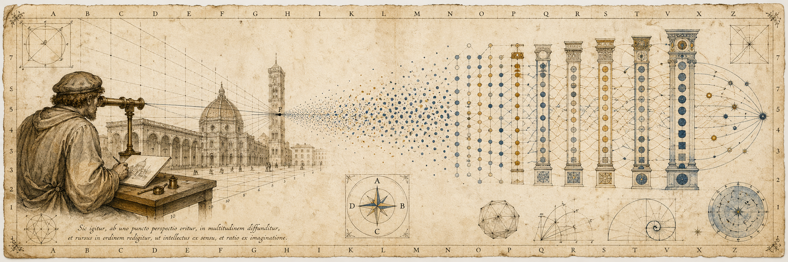
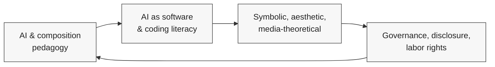

  

# Daniel Plate

> **AI authorship · symbolic form · creative autonomy · AI-native pedagogy**
>
> Professor of English at Lindenwood University. I work on what AI changes about authorship, what it doesn't, and what kinds of pedagogy and policy follow. My current writing develops alternatives to mandatory process disclosure, the aesthetics of generative output as symbolic form, AI-mediated coding as humanities literacy, and worker-side accountability frameworks for AI-mediated labor.

B.A. Taylor · M.F.A. Arkansas · Ph.D. Washington University in St. Louis · [ORCID 0000-0002-1238-5425](https://orcid.org/0000-0002-1238-5425) · [Lindenwood faculty profile](https://www.lindenwood.edu/arts-and-humanities/english-language-interdisciplinary-studies/english-ba/faculty/dan-plate/)

---

## Research Position

Authorship is a matter of responsibility, judgment, and accountability for what is presented — not exhaustive reporting of every tool, prompt, revision, or technological intervention. From that starting point, my work develops alternative frameworks for AI accountability, an aesthetic theory of generative symbolic objects, a defense of AI-mediated coding as humanities literacy, and pedagogies that treat AI as something to be used critically rather than feared or worshipped.

I am not anti-accountability. I am against blanket, mandatory, process-level AI disclosure as the default measure of integrity, and against academic alarmism that mistakes refusal for rigor.

## Books

<!-- BOOKS-START -->

- **[The Case Against Disclosure: Defending Creative Autonomy in the Age of AI](https://digitalcommons.lindenwood.edu/faculty-research-papers/756/)** — with James Hutson. Common Ground Research Networks, 2025. Argues against mandatory process-disclosure for AI use in creative, scholarly, professional, and technical work, and develops an alternative grounded in responsibility for outcomes. Reviewed in [*Postdigital Science and Education*](https://link.springer.com/article/10.1007/s42438-026-00629-5).
- **[Beyond Code: Redefining Programming Education Beyond STEM](https://digitalcommons.lindenwood.edu/faculty-research-papers/752/)** — with James Hutson. Chapman & Hall / Routledge, 2025. Argues that AI-assisted coding reframes software literacy for humanities students and broader interdisciplinary practice.
- **[Mind, Machine, and Will: Determinism, Responsibility, and Agency in the Age of AI](https://digitalcommons.lindenwood.edu/faculty-research-papers/763/)** — with James Hutson. Nova Science Publishers, 2025. Synthesizes recent work on agency, moral responsibility, governance, and human-machine collaboration.
- **[Generative AI in the English Composition Classroom: Practical and Adaptable Strategies](https://www.taylorfrancis.com/books/edit/10.4324/9781003507949/generative-ai-english-composition-classroom-james-hutson-daniel-plate-elizabeth-melick-susan-edele)** — co-edited with James Hutson, Elizabeth Melick, and Susan Edele. Routledge Research in Writing Studies, 2024/25. Practitioner volume covering historical framing, pedagogical foundations, classroom design, and forward-looking integration.

<!-- BOOKS-END -->

## In Progress

- **The New Perspectiva Artificialis: From the Mechanical Eye to the Algorithmic Symbolic Form** — Routledge, accepted for 2026. Argues that Renaissance linear perspective and transformer architectures are structurally parallel revolutions in symbolic mediation. Combines symbolic-form theory, close reading of historical sources, mechanistic interpretability work, and reproducible notebooks.
- **Semantic Density** — manuscript complete. Applies Nelson Goodman's symbolic-form aesthetics — syntactic density, semantic density, repleteness, exemplification — to chain-of-density prompting, generative world-making, and algorithmic criticism. Develops an aesthetic theory of LLM output as a symbolic object.

## Selected Articles and Chapters

<!-- ARTICLES-START -->

- **[The Case for Selective Non-Transparency in AI-Mediated Work: A Workers' Rights Framework](https://digitalcommons.lindenwood.edu/faculty-research-papers/787/)** &nbsp;· *Employee Responsibilities and Rights Journal*, 2025
- **[The Intellectual Bankruptcy of Anti-AI Academic Alarmism: A Rebuttal](https://digitalcommons.lindenwood.edu/faculty-research-papers/774/)** &nbsp;· *Teaching in Higher Education*, 2025 ([Critical Conversations podcast](https://www.tandfonline.com/journals/cthe20))
- **[Large Language Models as Machines of Beauty: Cognitive Averaging, Latent Space Geometry, and the Entropic Foundations of Aesthetic Preference](https://digitalcommons.lindenwood.edu/faculty-research-papers/)** &nbsp;· *ISAR Journal of Arts, Humanities and Social Sciences*, 2025
- **[The Pastor as Romantic Author: AI, Preaching, and the Unacknowledged Inheritance of Authenticity](https://doi.org/10.30560/mct.v1n2p14)** &nbsp;· *Media, Communication, and Technology*, 2025
- **[Composition Pedagogy as AI-Native Coding: From Design Kit to Scholarly Framework](https://digitalcommons.lindenwood.edu/faculty-research-papers/)** &nbsp;· *World Journal of Arts, Education and Literature*, 2025
- **[Writing as Curation: Empowering Authorial Agency in AI-Assisted Composition Through Style Prompting and Quotation Glosses](https://digitalcommons.lindenwood.edu/ijedie/vol3/iss1/3/)** &nbsp;· *International Journal of Emerging and Disruptive Innovation in Education*, 2025
- **[Bridging Classical Rhetoric and AI: A Systematic Framework for Developing Authorial Voice Through Large Language Models](https://digitalcommons.lindenwood.edu/theses/1411/)** &nbsp;· M.A. thesis, Lindenwood, 2025
- **[Reclaiming the Symbol: Ethics, Rhetoric, and the Humanistic Integration of GAI — A Burkean Perspective](https://zenodo.org/records/10802930)** &nbsp;· *ISRG Journal of Arts, Humanities and Social Sciences*, 2024
- **[Embracing AI in English Composition: Insights and Innovations in Hybrid Pedagogical Practices](https://ojs.bonviewpress.com/index.php/IJCE/article/view/2290)** &nbsp;· *International Journal of Changes in Education*, 2024
- **[Bridging Disciplines with AI-Powered Coding: Empowering Non-STEM Students to Build Advanced APIs in the Humanities](https://digitalcommons.lindenwood.edu/faculty-research-papers/)** &nbsp;· *ISAR Journal of Arts, Humanities and Social Sciences*, 2024
- **[The Algorithm of Fear: Unpacking Prejudice Against AI and the Mistrust of Technology](https://doi.org/10.61453/joit.v2024no38)** &nbsp;· *Journal of Innovation and Technology*, 2024
- **[Working With (Not Against) the Technology: GPT-3 and Artificial Intelligence in College Composition](https://digitalcommons.lindenwood.edu/faculty-research-papers/490/)** &nbsp;· *Journal of Robotics and Automation Research*, 2023
- **[Synthesizing Sentience: Integrating Large Language Models and Autonomous Agents for Emulating Human Cognitive Complexity](https://doi.org/10.51219/JAIMLD/Jeremiah-Ratican/17)** &nbsp;· *Journal of AI, Machine Learning and Data Science*, 2023
- **[Augmented Creativity: Leveraging Natural Language Processing for Creative Writing](https://doi.org/10.4236/adr.2022.103029)** &nbsp;· *Art and Design Review*, 2022
- **[Artificial Intelligence and the Disruption of Higher Education: Strategies for Integrations across Disciplines](https://doi.org/10.4236/ce.2022.1312253)** &nbsp;· *Creative Education*, 2022

Chapters in *Generative AI in the English Composition Classroom* (Routledge, 2024/25): [Introduction](https://doi.org/10.4324/9781003507949-1), [Pedagogical Foundations](https://doi.org/10.4324/9781003507949-2), [Conclusion](https://doi.org/10.4324/9781003507949-5). Other chapters in [*Generative AI in Teaching and Learning*](https://doi.org/10.4018/979-8-3693-0074-9.ch001), [*Humanizing Online Teaching and Learning in Higher Education*](https://doi.org/10.4018/979-8-3693-0762-5.ch011), and [*Advanced Virtual Assistants*](https://doi.org/10.5772/intechopen.1001832).

<!-- ARTICLES-END -->

## Teaching Repositories

These are public courses and experiments my students and collaborators use. Each one is a working example of the kind of AI-mediated practice the writing argues for.

- **[10 Things to Try with Hugging Face Transformers](https://github.com/buildLittleWorlds/10-things-to-try-with-hugging-face)** — ten-notebook beginner course on pipelines, NLP tasks, embeddings, model comparison, and pipeline internals.
- **[10 Things to Try with Vision Transformers](https://github.com/buildLittleWorlds/10-things-to-try-vision-transformers)** — companion course on image classification, detection, segmentation, captioning, CLIP, and visual question answering.
- **[Human-Centered AI Applications](https://github.com/buildLittleWorlds/human-centered-ai-applications)** — undergraduates move from a problem they care about to a deployed AI application using a Plan-Direct-Examine-Record workflow.
- **[AI Model Experiments](https://github.com/buildLittleWorlds/ai-model-experiments)** — Hugging Face and Colab curriculum for running models, comparing outputs, reading model cards, and testing limitations.
- **[Claude Code Skills: Basics and Beyond](https://github.com/buildLittleWorlds/claude-code-skills-basics-and-beyond)** — course sequence on Claude Code, skills, hooks, subagents, and multi-step AI-assisted development.
- **[Transformers.js Experiments](https://github.com/buildLittleWorlds/transformers-js-experiments)** — browser-based experiments with client-side transformer models, WebGPU, and ONNX Runtime.
- **[Bluest Hour Almanac](https://github.com/buildLittleWorlds/bluest-hour-almanac)** — design and AI classification experiment built around a blue-hour walk journal.

## How the Strands Connect

The same argument runs across all four: that AI participation is most defensible when treated as a tool of judgment rather than a substitute for it, and that this stance has different operational consequences in writing, in coding, in aesthetic theory, and in policy.

## Frequent Collaborators

Most of the collaborative work above is co-authored with [James Hutson](https://www.lindenwood.edu/academics/colleges-and-schools/college-of-arts-and-humanities/faculty-and-staff/james-hutson/). Recurring co-authors on the composition volume and related pieces include [Elizabeth Melick](https://www.lindenwood.edu/) and [Susan Edele](https://www.lindenwood.edu/). Single-authored work is marked accordingly.

## Contact

[Lindenwood faculty profile](https://www.lindenwood.edu/arts-and-humanities/english-language-interdisciplinary-studies/english-ba/faculty/dan-plate/) · [ORCID](https://orcid.org/0000-0002-1238-5425) · [GitHub](https://github.com/buildLittleWorlds)

<!--
Variant A — Restrained Academic (revised April 2026 against the full scholarship dossier)

Design notes (delete before committing if you adopt this variant):
- Position statement broadened from "disclosure" alone to four research clusters identified in the dossier.
- Books promoted to a top-level section (was buried as one inline link). Three Hutson co-authored books plus the co-edited Routledge volume.
- Forthcoming books in their own section so the trajectory is visible.
- Articles list expanded to a near-complete corpus from the dossier.
- Mermaid diagram now reflects the four actual clusters: pedagogy, coding literacy, symbolic/aesthetic, governance/labor.
- MFA from Arkansas added to the credential line — important for a creative-writing professor.
- All assets remain text or shields.io URLs (high uptime). This page will look identical in 2030.
- For any article without a clean public DOI, the Lindenwood DigitalCommons author search URL stands in; you may want to replace these with the specific item URLs when the time comes.
-->
