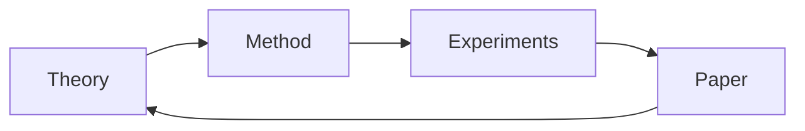

# GitHub Profile README Design — A Research Dossier

A briefing on the design space of GitHub profile READMEs (the special `<username>/<username>` repository whose `README.md` renders at the top of a user's profile page). Aimed at a thoughtful audience preparing teaching material around AI and research; assumes familiarity with Markdown and GitHub.

The profile README has unusual constraints: it is rendered by GitHub's sandboxed Markdown pipeline, so authors get rich layout but no behaviour. The interesting design moves all happen at the seam between what the renderer permits and what external image services can deliver. Section 1 covers the static substrate, Section 2 the dynamic services that smuggle freshness in through `` tags, Section 3 asset creation, Section 4 information architecture, Section 5 verified exemplars, Section 6 the failure modes that make many of these techniques regrettable in hindsight.

---

## 1. Markdown-only techniques

GitHub renders profile READMEs through GitHub Flavored Markdown via a sanitizer (`github/markup` calling `cmark-gfm`, then a strict allow-list filter). The allow-list is the key constraint: any HTML element or attribute outside it is silently stripped.

**What works.**

- A useful subset of HTML inline: `<a>`, ``, `<picture>`, `<source>`, `<video>` (limited), `<sub>`, `<sup>`, `<kbd>`, `<details>`, `<summary>`, `<table>`, `<div>`, `<p>`, `<br>`, `<hr>`, headings, lists.
- Attribute-based alignment via `align="center"` on `<div>`, `<p>`, ``, `<table>`. This is deprecated in HTML5 elsewhere but GitHub still honours it inside Markdown, which is why nearly every "centered banner" profile uses `<div align="center">`.
- Image sizing via `width=` / `height=` attributes on `` — pixels or percentages.
- Tables for two-column layouts (Simon Willison's profile uses `<table><tr><td valign="top" width="33%">` for a three-column "Releases / Blog / TIL" panel — a convincing layout trick that survives mobile reasonably well because GitHub's mobile CSS lets the columns wrap).
- `<details>`/`<summary>` for collapsible sections — useful for hiding stat dumps, archived projects, FAQ-style content.
- Footnotes (`[^1]`), task lists (`- [x]`), `<sub>`/`<sup>` for super/subscript, `<kbd>` for keyboard keys.
- GitHub's `[!NOTE]`, `[!TIP]`, `[!WARNING]`, `[!IMPORTANT]`, `[!CAUTION]` blockquote callouts.
- Mermaid diagrams in fenced ``` ```mermaid ``` blocks (rendered server-side; see Section 3).
- LaTeX math: `$inline$` and `$$display$$` (KaTeX-rendered server-side).

**Light/dark mode swap — the most useful HTML-in-Markdown trick.** Two complementary mechanisms:

1. The URL-fragment hack `#gh-light-mode-only` / `#gh-dark-mode-only`:
   ```markdown
   
   
   ```
2. `<picture>` with `prefers-color-scheme` (cleaner; one element):
   ```html
   <picture>
     <source media="(prefers-color-scheme: dark)"  srcset="banner-dark.svg">
     <source media="(prefers-color-scheme: light)" srcset="banner-light.svg">
     
   </picture>
   ```
   This is what Platane's snake-graph and many polished profiles use because it degrades gracefully in feed readers and on the mobile app.

**Badges.** Two services dominate:
- `img.shields.io` — the most flexible. Static syntax: `https://img.shields.io/badge/<label>-<message>-<color>?style=flat&logo=<simple-icon>`. Dynamic endpoints exist for GitHub stars/forks/issues, npm version, build status, custom JSON, etc.
- `badgen.net` — similar API, slightly different aesthetic, fewer dynamic data sources.
  ```markdown
  
  
  ```
  `style=` accepts `flat`, `flat-square`, `plastic`, `for-the-badge`, `social`. `logo=` pulls from Simple Icons (~3000 brand icons). For non-standard logos, `DenverCoder1/custom-icon-badges` extends the registry.

**Anchored TOCs.** GitHub auto-generates header anchors using a slug of the heading. So `[Recent Work](#recent-work)` jumps to `## Recent Work`. Useful in long profiles; almost no one with a short profile bothers, and they shouldn't.

**Emoji as section markers.** `:rocket:` / `:books:` / `:wrench:` style shortcodes are normalized to Unicode and render natively. They function as visual anchors, but their semantic value is weak and they're a primary culprit in the "every profile looks the same" problem (Section 6).

**What CANNOT be done.** This list matters because students will guess wrong:
- No `<script>`, no `<style>`, no inline `style=` attribute, no `class=` (other than a tiny allow-list), no `id=` you can rely on (anchors are auto-generated only on headings).
- No `<iframe>`, `<object>`, `<embed>`, `<form>`, `<input>`, `<button>`.
- No `<link rel="stylesheet">`, no `<meta>`, no `@import`.
- Images are sandboxed through GitHub's Camo proxy. The proxy strips cookies, rewrites the URL, caches aggressively, and rejects non-HTTPS sources. Every "live" widget you see is an SVG image whose server happens to render fresh content on each request.
- Animated GIFs and animated SVGs (with SMIL or CSS keyframes) work, but cannot respond to clicks, hovers, or any user input.
- No JavaScript, full stop. There is no escape valve.

The interesting consequence: every "interactive-looking" thing on a GitHub profile is either (a) a static SVG generated by a third-party, (b) a regenerated asset committed by a scheduled GitHub Action, or (c) a `<picture>` element switching on `prefers-color-scheme`. Knowing this collapses the apparent complexity of the maximalist profiles.

---

## 2. Dynamic content via external services

The pattern is uniform: an external server exposes endpoints that return SVG (or PNG) keyed on your username. You embed the URL as an image. GitHub's Camo proxy fetches it, caches it (typically 5–10 minutes), and re-fetches when readers view your profile. Caveat threaded through everything below: these are third-party services with no SLA. See Section 6.

**`anuraghazra/github-readme-stats`** — the dominant stats card. Hosted at `github-readme-stats.vercel.app`. Three primary endpoints: `/api?username=…` (the stats card), `/api/top-langs?username=…` (top languages), `/api/pin?username=…&repo=…` (extra pinned repos beyond GitHub's six). Rich theming (`theme=dark|radical|tokyonight|gruvbox|merko|…`), per-color overrides (`title_color`, `icon_color`, `bg_color` with gradient support `bg_color=DEG,COLOR1,COLOR2`), and three layout options for top-langs (`normal`, `compact`, `donut`, `donut-vertical`, `pie`).

```markdown


```

The project's README explicitly recommends self-hosting on Vercel (with your own GitHub PAT) because the public instance is best-effort and prone to rate-limiting; for a course assignment that has to render reliably in six months, the self-hosted recommendation is load-bearing.

**`DenverCoder1/github-readme-streak-stats`** — current-streak card (current streak, longest streak, total contributions). Same self-hosting recommendation. Hosted demo at `streak-stats.demolab.com`.

**WakaTime integration.** Two flavours:
- `github-readme-stats` has a `/api/wakatime` endpoint that takes a public WakaTime username.
- `athul/waka-readme` is a GitHub Action that writes a code-time block directly into your README between `<!--START_SECTION:waka-->` and `<!--END_SECTION:waka-->` markers. This is what `abhisheknaiidu/abhisheknaiidu` uses. It produces a fenced code block of language-by-language hours rather than an image — slightly more accessible, more text-heavy.

**`ryo-ma/github-profile-trophy`** — a row of "trophy" SVGs reflecting your account stats. Visually loud; an early signal that you're using a generator. Mentioned for completeness; usually best skipped.

**`Platane/snk` — the snake game contribution graph.** Generates an animated SVG of a snake eating your contribution squares. The pattern is unusual: snk is a GitHub Action that runs on schedule, generates `github-contribution-grid-snake.svg` and a `-dark.svg` variant, pushes them to an `output` branch of your profile repo, and you reference them via `<picture>`. This means the asset is hosted in your own repo, not on someone else's server — the most durable of the dynamic widgets. See Platane's own profile for the canonical setup.

**`DenverCoder1/readme-typing-svg`** — the "typing-then-deleting" animated text effect. Pure SVG with SMIL animation. Hosted at `readme-typing-svg.demolab.com`. Query params: `lines=`, `font=`, `color=`, `pause=`, `vCenter=`. Common on student/early-career profiles; very rare on senior profiles.

```markdown

```

**`ashutosh00710/github-readme-activity-graph`** — a sparkline-style rendering of your contribution activity over the last ~30 days. More visually informative than the trophy widget; appears in many "polished maximalist" profiles.

**Spotify "now-playing" widgets.** Several implementations; `kittinan/spotify-github-profile` is the most-used. Requires you to register a Spotify developer app, OAuth, and self-host. High setup cost, fragile (Spotify sometimes deprecates endpoints), and rarely worth the effort for a researcher profile.

**RSS / Dev.to / Medium feed embeds.** The dominant pattern is `gautamkrishnar/blog-post-workflow`, a GitHub Action that takes a feed URL, fetches the latest N items on a schedule, and rewrites a marker block in your README:
```markdown
<!-- BLOG-POST-LIST:START -->
<!-- BLOG-POST-LIST:END -->
```
Same author also publishes `gautamkrishnar/keep-readme-active`. The pattern generalizes — `simonwillison.net` uses a custom Action that pulls from his blog's Atom feed, his TIL site's feed, and GitHub releases, regenerating three columns of links. (See Simon Willison exemplar in Section 5.)

**Visitor counters.** `komarev.com/ghpvc/?username=…` is the de facto profile-view counter. Note the methodology caveat: it counts loads of the badge image, not unique visitors, and is trivially gameable. Increasingly considered a "tell" of an over-decorated profile.

**General pattern for scheduled-update Actions.** The structure used across many of the above:
```yaml
name: Update README
on:
  schedule: [{ cron: "0 */6 * * *" }]   # every 6 hours
  workflow_dispatch:
jobs:
  update:
    runs-on: ubuntu-latest
    steps:
      - uses: actions/checkout@v4
      - uses: gautamkrishnar/blog-post-workflow@v1
        with:
          feed_list: "https://example.com/feed.xml"
      - run: |
          git config user.name  "github-actions"
          git config user.email "github-actions@users.noreply.github.com"
          git diff --quiet || (git add README.md && git commit -m "update" && git push)
```
This is the engine behind Simon Willison's three-panel layout, Thomas Guibert's self-updating README, and many "latest videos" sections. Once students grasp this loop, the maximalist profiles stop looking magical.

---

## 3. Asset creation

**Banners and headers.** Practical tooling, in order of community usage: Figma (free tier, dominant), Canva (template-driven, low ceiling), Photopea (browser Photoshop clone, opens `.psd`), Excalidraw (sketch aesthetic, popular for diagrams), draw.io / diagrams.net (BPMN and flowcharts). For the "drawn with my own hand" feel that several tasteful profiles have (e.g., Kent C. Dodds — see Section 5), Procreate or pen-and-paper-then-photographed both work; the trick is a single high-resolution PNG with transparent background sized to ~1280×320, since GitHub displays profile READMEs in a column whose effective width is roughly 920px on desktop and ~380px on mobile.

**Animated SVGs.** Two routes:
- Hand-authored SMIL (`<animate>`, `<animateTransform>`). Feels archaic but works perfectly in GitHub's image proxy. Good for small flourishes; tedious for anything complex.
- CSS keyframes inside `<style>` inside an SVG. Allowed inside the SVG document itself (GitHub strips top-level `<style>` but doesn't enter the SVG).

**`kyechan99/capsule-render`.** The source of the gradient banner with a wave/curve at the bottom that you've seen on hundreds of profiles. Endpoint: `capsule-render.vercel.app/api?type=…&color=…&text=…`. Types include `wave`, `waving`, `egg`, `shark`, `slice`, `rect`, `soft`, `rounded`, `cylinder`, `venom`, `speech`, `blur`, `transparent`. Color modes: `auto` (curated palette), `gradient`, `timeAuto` (time-of-day), `_hexcode`, or a custom gradient `0:EEFF00,100:a82da8`. Animations: `fadeIn`, `scaleIn`, `blink`, `blinking`, `twinkling`. The same caveat applies — the project's own README warns the public instance is "provided on a best-effort basis" and recommends forking and deploying to your own Vercel for stability.

**Mermaid.** GitHub natively renders Mermaid in fenced code blocks since early 2022. Supports flowcharts, sequence, class, state, ER, gantt, mindmap, timeline. Useful in a researcher profile to visualize a research agenda or a paper pipeline:
````markdown

````

**LaTeX.** GitHub renders KaTeX inline (`$E=mc^2$`) and display (`$$\nabla \cdot \mathbf{E} = \frac{\rho}{\varepsilon_0}$$`). Native, no plugin needed. For an ML/NLP researcher this matters: a profile can include a single equation that captures the kind of work you do, which both signals the field and provides a concrete handle for collaborators.

**ASCII art / figlet.** Treated as code blocks. Render in a monospace font; line-wrap awkwardly on mobile. Used very sparingly on serious profiles.

**Hosting assets in the same special repo vs. external CDNs.** Three options, in declining durability:
1. Commit the asset (PNG / SVG / GIF) to the profile repo itself and reference it via relative path or `raw.githubusercontent.com` URL. Most durable; you control it.
2. Use GitHub's "drag-and-drop into an issue" trick — uploads to `user-images.githubusercontent.com`. Durable as long as GitHub is up; not under your access control after upload.
3. External services (Imgur, Cloudinary, your own CDN, third-party widget servers). Most fragile. The single largest cause of profiles "looking great today, broken in a year" (Section 6) is reliance on third-party SVG endpoints that quietly start 404'ing.

---

## 4. Information-architecture patterns

The dominant design move is the choice of **lead** — what a viewer reads first.

- **"About me" lead.** Short identity sentence, then sections. Default. Reads like a personal landing page. Works for most people.
- **"Currently working on" lead.** Opens with active projects. Signals momentum and gives drive-by visitors something concrete. Adopted by Simon Willison, Joshua Levy, and most "builder-in-public" profiles.
- **"What I make" lead.** Pinned repos as portfolio, sometimes with a single sentence for context. The minimalist designer's choice (Karpathy is the extreme case: one sentence and his pins do the work).

The **"Currently / Previously / Building" temporal triple** is a compressed CV format that fits the profile-README form well. Three short sections, each three to five bullets. It tells a visitor where you are, what you did, and what to expect next, in roughly the time it takes to glance at a business card.

**Pinned repos as portfolio.** GitHub allows six pins; pin-style cards (`/api/pin?…`) extend this without the six-pin cap, but with a uniform visual treatment. The decision matters: pin order is implicit ranking. For an academic profile, the strongest signal is one repo per "kind of work" (a paper repo, a course repo, a tooling repo) rather than six versions of the same thing.

**The "now" page pattern.** Borrowed from [nownownow.com](https://nownownow.com) (Derek Sivers' invention). A single "what I'm focused on right this month" paragraph, dated. Maps cleanly to a profile README's `## Now` section, and several thoughtful researchers use it. Lower maintenance than scheduled-Action-driven content because you only update it when the answer changes.

**Linked papers, talks, posts (academic profile).** Two viable structures:
1. A flat reverse-chronological list with DOI badges — see Rougier exemplar (Section 5). Tells viewers exactly what you've published and links to the artifact.
2. Topic clusters — group by research theme rather than year. Works better when your output spans years and you want to communicate a research agenda.

**Personal website vs. living entirely in the README.** The strongest researcher profiles do both: the README is a curated landing page that links to a fuller personal site. Living entirely in the README is fine for early-career profiles; it shows constraint and craft. Living entirely on the personal site (with a one-line README) is fine for established figures whose name is searchable. The unhappy middle is duplicating everything in both places, which inevitably drifts.

**Skill matrices vs. a sentence about skills.** Strong opinion: skill matrices ("HTML/CSS/JS/Python with progress bars" or rows of badges) are the single most over-used pattern, and they signal early-career almost universally. A sentence — "I write Python and TypeScript every day; I read and occasionally write Rust and Go; I'm fluent in PyTorch and getting fluent in JAX" — is more informative, harder to fake, and lower-maintenance. For a research profile in particular, listing twenty badges of frameworks tells a reader nothing about how you actually work.

---

## 5. Verified exemplars

Each profile below was fetched and inspected on 2026-04-25. URLs are `github.com/<username>` unless noted.

### Academic / researcher

**Nicolas Rougier — `github.com/rougier`** (computational neuroscience, INRIA Bordeaux). Reference example for a researcher README. The README in `rougier/rougier` is a curated bibliography: `### Open access books & journals`, `### Courses & tutorials`, `### Development`, `### Posters`, `### Science`. The Science section is reverse-chronological papers, each one a bold link plus a right-aligned DOI badge generated through Shields:
```markdown
- <a href="https://doi.org/10.7554/eLife.87356.1">
    
  </a>
  **[A dynamical computational model of theta generation in hippocampal circuits (2023)](https://github.com/rougier/memstim-hh)**
```
Each repo also gets a star count via Shields' `github/stars` endpoint. The information architecture is the lesson: this is a living CV, not a portfolio, and the visual treatment (no banners, no animations, modest sponsor buttons) supports that. For a course on AI + research, this is the closest thing to a canonical example.

**Andrej Karpathy — `github.com/karpathy`.** Single line: "I like deep neural nets." Then the pins do the work: nanoGPT, llm.c, micrograd, llama2.c. This is the senior-researcher minimalist mode — name and pins are sufficient, the README is a deliberate counter-signal against decoration. Useful as a foil to discuss audience: this works because Karpathy's name is search-discoverable; a student writing the same one-liner would seem under-curated.

### Designer-developer / tasteful minimal

**Kent C. Dodds — `github.com/kentcdodds`.** A single hand-illustrated banner image linking to his personal site, plus one sentence: "Learn more about me." Total file: ~5 lines of Markdown. Communicates strong brand, defers all detail to the website. Works because he has invested heavily in the website.

**Simon Willison — `github.com/simonw`.** Three-column HTML table, top sentence pointing to blog/newsletter/Mastodon/Bluesky, then a `<!-- recent_releases starts -->` / `<!-- blog starts -->` / `<!-- tils starts -->` set of marker blocks updated by a scheduled GitHub Action ([described in his post](https://simonwillison.net/2020/Jul/10/self-updating-profile-readme/)). The build badge in the bottom corner links to the Action that does the work. This is the canonical "self-updating researcher/builder" exemplar — every entry is a link to a real artifact, the layout is a single HTML table, and the freshness comes from the Action, not from a third-party widget.

### Maximalist / dynamic

**Anurag Hazra — `github.com/anuraghazra`.** Author of `github-readme-stats`. His own README is the canonical demo: a banner header image, brief about-me bullets, language icon strip, then the two stat cards side-by-side via a Markdown table. Restrained relative to the wilder maximalist profiles — the cards are present but the whole page reads in well under a minute.

**DenverCoder1 (Jonah Lawrence) — `github.com/DenverCoder1`.** The fully-loaded maximalist profile. Header avatar; typing SVG; social-icon strip; sponsorship table; collapsible `<details>` sections for top OSS projects, OSS contributions, latest YouTube videos (auto-updated by his own `github-readme-youtube-cards`), favourite tools (~80 badges across languages/frameworks/databases/software), streak stats, profile stats, top languages, activity graph, recent activity (auto-updated by `jamesgeorge007/github-activity-readme`), Holopin badges. Useful precisely because he uses every technique in the design space; for teaching, it's the "all the tools at once" reference.

**Platane — `github.com/Platane`.** The contribution-graph snake. The README is essentially:
```html
<picture>
  <source media="(prefers-color-scheme: dark)"  srcset=".../github-contribution-grid-snake-dark.svg">
  <source media="(prefers-color-scheme: light)" srcset=".../github-contribution-grid-snake.svg">
  
</picture>
```
Plus a one-line credit. The lesson is that a single distinctive dynamic element with a tight `<picture>` setup can carry an entire profile, when the element is well-chosen.

### Self-updating / "feeds in the README"

**Thomas Guibert — `github.com/thmsgbrt`.** The original "self-updating README" reference (his Medium tutorial is one of the most-cited starting points for this pattern). Tech stack badges, an open-source projects table generated from Shields, a "latest posts" list, and a Stockholm weather/sun-time block — all regenerated every three hours by a GitHub Action. Slightly dated stylistically (heavy badges, multiple emoji-icon images per line) but historically important: it's the profile that taught the wider community the scheduled-Action update pattern.

**Iuri Silva — `github.com/iuricode`.** Portuguese-language opening, clean two-link badge row, brief bio paragraph. He's better known for his curated "padrões-de-projeto" content than for the README itself, but the profile is a good example of restraint within the maximalist tradition — present-tense bio, two badges, no card dump.

### Long-form prose / heavy-text

**Joshua Levy — `github.com/jlevy`.** "Hi! In case you want to get to know me or my work, this is a cheat sheet." Then ~1,000 words organized by `### Work and Interests`, `### Personal`, `### Projects`, `### Reaching Me`, with sub-bullets. No images, no badges except a few inline emoji. Demonstrates that a profile can be entirely prose and still feel finished — the design lives in the writing, not the layout.

### Student / early-career

**Maxwell Joslyn — `github.com/maxwelljoslyn`.** A grad-student profile that lands well: long-form descriptions of three software projects (a TTRPG GM training tool, his MSc thesis on a runtime-editable tabletop RPG companion, and a custom text adventure), each with screenshots, prose, and Markdown footnotes (`[^1]`, `[^2]`, `[^3]`). No banners, no badges. Reads more like a portfolio essay than a typical README — and that's the point. For students, this is the most directly imitable model: choose three things, write a paragraph and add a screenshot for each, link the artifact, use footnotes for asides.

**Lucas Nadolskis — `github.com/lucasnad27`.** Titled "Operating Instructions for Lucas." Lists his "first principles for good software," organizational tools, developer tools (with a single XKCD comic for visual punctuation), frontend / backend / ops stack. Demonstrates the "operating manual" framing — a portable rhetorical device that sidesteps the standard "About me" cliché.

### Notes on profiles I checked but did not include

- Sindre Sorhus (`github.com/sindresorhus`) — an intentional GeoCities-pastiche README of animated GIFs and "under construction" badges, perfectly in character for him but a parody not an exemplar.
- Adam Wathan, Caleb Porzio — neither has a `<username>/<username>` repo at the time of writing (verified by 404 on both `master` and `main`); their GitHub presence lives in their personal sites and the Tailwind/Laravel ecosystems they've built.
- Ali Spittel (`aspittel`) — a four-line README that is dated and not currently distinctive.
- Addy Osmani (`addyosmani`) — uses the default GitHub-suggested template ("I'm currently working on…"). A useful counter-example: a famous developer with a non-curated profile, which proves the design space is optional.

---

## 6. Caveats and pitfalls

**The "broken in six months" problem.** Profiles built around third-party SVG endpoints decay quickly. The public instances of `github-readme-stats`, `streak-stats`, `capsule-render`, `readme-typing-svg`, and `komarev` are all rate-limited shared services. In their own READMEs, both Anurag Hazra (for `github-readme-stats`) and Kyechan99 (for `capsule-render`) explicitly warn the public instance is best-effort and recommend self-hosting on Vercel. For a course assignment that should still render correctly when a hiring manager looks at it eighteen months later, the practical guidance is: prefer assets you commit to your own profile repo (Platane's snake is a good model — the SVG is regenerated by an Action and pushed to your own `output` branch); use third-party SVG endpoints sparingly; avoid services that have already gone quiet (older lists of profile widgets are full of dead links to services like `metrics.lecoq.io` whose endpoints are unreliable).

**Animated content that distracts from substance.** Typing SVGs, twinkling banners, scrolling marquees: cute the first time, friction every subsequent visit, and ranked lower by the (small but real) population of viewers who care about reading speed. The well-known principle: animation should mark a state change, not a permanent decoration. For a researcher profile, the cost is higher — animated decorations subtly cue "early career" and undercut the work itself.

**The "everyone has the same stats card" effect.** When `github-readme-stats` and the streak-stats card appeared on every other developer profile circa 2020–2022, they stopped functioning as a signal of effort and started reading as a signal of conformity. The current state is that adding the default stats card is approximately neutral — it doesn't help, it doesn't hurt, but it doesn't communicate anything specific about you. If you do use them, customise the theme to match a personal palette (the `bg_color=DEG,COLOR1,COLOR2` gradient option, or a transparent background, both help), and keep one card not three.

**Mobile rendering.** GitHub's mobile profile view is narrow (~380px). Multi-column tables wrap; SVGs scaled with fixed pixel widths overflow horizontally. Test in DevTools at 375px width before publishing. Simon Willison's three-column layout works because the columns wrap to stack vertically; many profiles with side-by-side stat cards look broken on mobile because the cards have fixed widths set inline.

**Accessibility.** Three concrete failure modes:
- **Missing alt text.** Almost every "set of badges" pattern uses `` or no alt at all. Screen readers either announce nothing (best case) or announce a noisy URL fragment (worst case). The fix is trivial — meaningful `alt=` on every image. GitHub publishes [accessibility guidance for profile pages](https://github.blog/developer-skills/github/5-tips-for-making-your-github-profile-page-accessible/).
- **Color contrast.** Custom-coloured stats cards and capsule-render banners often pair pale text with pale backgrounds. Aim for WCAG AA contrast on any foreground/background combination you choose; the dark themes (`tokyonight`, `dark`, `gruvbox`) are usually safer than custom palettes.
- **Motion.** GitHub doesn't expose `prefers-reduced-motion` to embedded SVGs reliably (the proxy doesn't pass user CSS), so the responsibility is on the asset author. If you must include animation, prefer SVGs that animate once on load and rest, not loops.

**The deeper risk: the README starts working harder than the work.** A maximalist profile that takes a weekend to assemble and a weekend per quarter to maintain is time not spent on the actual research. The strongest researcher profiles in Section 5 (Karpathy, Rougier, Willison) all share an asymmetry: the README is a thin layer of curation over a much larger body of substance — papers, releases, posts. When the curation overshoots the substance, the effect is the opposite of what was intended. The most useful prompt to give students writing their first profile README is probably: "what is the smallest version of this page that still represents you?" — and then iterate up from there only as the substance grows.

---

## Sources

- [Awesome GitHub Profile READMEs (abhisheknaiidu)](https://github.com/abhisheknaiidu/awesome-github-profile-readme)
- [github-readme-stats README (anuraghazra)](https://github.com/anuraghazra/github-readme-stats)
- [Platane/snk — snake contribution graph](https://github.com/Platane/snk)
- [readme-typing-svg (DenverCoder1)](https://github.com/DenverCoder1/readme-typing-svg)
- [github-readme-streak-stats (DenverCoder1)](https://github.com/DenverCoder1/github-readme-streak-stats)
- [capsule-render (kyechan99)](https://github.com/kyechan99/capsule-render)
- [Shields.io](https://shields.io/)
- [Simon Willison — How my self-updating profile README works](https://simonwillison.net/2020/Jul/10/self-updating-profile-readme/)
- [Thomas Guibert — How to Create a Self-Updating README](https://medium.com/@th.guibert/how-to-create-a-self-updating-readme-md-for-your-github-profile-f8b05744ca91)
- [GitHub Blog — 5 tips for making your GitHub profile page accessible](https://github.blog/developer-skills/github/5-tips-for-making-your-github-profile-page-accessible/)
- [GitHub Docs — Managing accessibility settings](https://docs.github.com/en/account-and-profile/how-tos/account-settings/managing-accessibility-settings)
- [GitHub Changelog — Specify theme context for images in markdown](https://github.blog/changelog/2022-05-19-specify-theme-context-for-images-in-markdown-beta/)
- [Releasing research code (paperswithcode)](https://github.com/paperswithcode/releasing-research-code)
- Verified exemplar profiles (fetched 2026-04-25): [rougier](https://github.com/rougier), [karpathy](https://github.com/karpathy), [kentcdodds](https://github.com/kentcdodds), [simonw](https://github.com/simonw), [anuraghazra](https://github.com/anuraghazra), [DenverCoder1](https://github.com/DenverCoder1), [Platane](https://github.com/Platane), [thmsgbrt](https://github.com/thmsgbrt), [iuricode](https://github.com/iuricode), [jlevy](https://github.com/jlevy), [maxwelljoslyn](https://github.com/maxwelljoslyn), [lucasnad27](https://github.com/lucasnad27).
